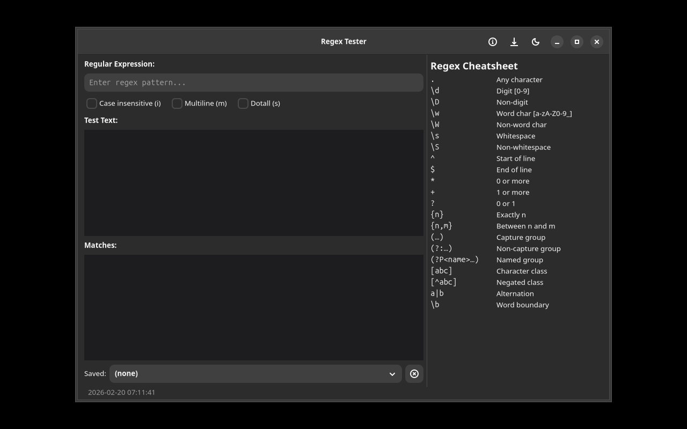

# regex tester [](https://github.com/yeager/regex-tester)


## Screenshot



## Description

regex tester is a GTK4/Adwaita application 

[Application description will be added based on individual repo functionality]

## Features

- Modern GTK4/Adwaita interface
- [Feature list to be customized per repo]


## Installation

### APT Repository (Debian/Ubuntu)

```bash
echo "deb https://yeager.github.io/debian-repo stable main" | sudo tee /etc/apt/sources.list.d/yeager-l10n.list
sudo apt update
sudo apt install regex-tester
```

### DNF Repository (Fedora/RHEL)

```bash
sudo dnf config-manager --add-repo https://yeager.github.io/rpm-repo/yeager-l10n.repo
sudo dnf install regex-tester
```

### Building from Source

```bash
git clone https://github.com/yeager/regex-tester.git
cd regex-tester
pip install -e .
```

## Translation

This application is managed on Transifex: https://app.transifex.com/danielnylander/regex-tester/

Available in 11 languages: Swedish, German, French, Spanish, Italian, Portuguese, Dutch, Polish, Czech, Russian, and Chinese (Simplified).

## License

GPL-3.0-or-later

## Author

Daniel Nylander (daniel@danielnylander.se)
